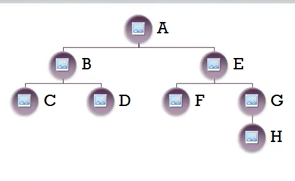

**Depth first search uses stack** 

- Stack is Last in first out
- Starts at the source vertex
- Pick one of the not visited neighbor and visits it.
- This process repeats recursively and the recursion repeats into a branch until it cannot go any further.

| Column1 | This is a long column name | Column3              |                   |
|--------:|----------------------------|:--------------------:|:------------------|
|         |                            |                      |                   |
|         |                            |                      | a value           |
|         |                            |                      |                   |
|         |                            | This is a long value | but why?          |
|         |                            |                      |                   |
|         |                            |                      | Here is something |
|         |                            |                      |                   |